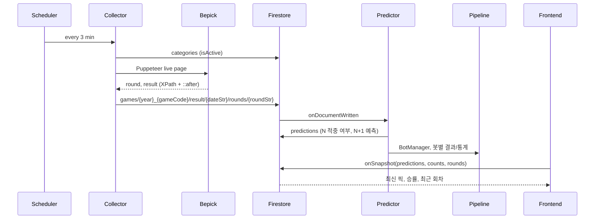

# 알파픽(AlphaPick) 프로젝트 분석 보고서

이 문서는 프로젝트 전체 구조, 핵심 데이터 흐름, 구조적 리스크, 향후 개선 방향을 정리한 분석 보고서입니다.

---

## 1. 프로젝트 전체 구조 및 핵심 흐름

### 1.1 디렉터리 구조 개요

| 영역 | 경로 | 역할 |
|------|------|------|
| **프론트엔드** | `app/` | Next.js App Router 페이지 (메인, 로그인/회원가입, 커뮤니티, 관리자) |
| | `components/` | 공용 UI(`ui/`), 메인 화면용(게임 메뉴, 타이머, AI 봇 목록, 결과 컴포넌트), 관리자 전용(`admin/`) |
| | `lib/` | Firebase 클라이언트 초기화(`firebase.ts`), 인증 컨텍스트(`AuthContext.tsx`) |
| **백엔드** | `functions/src/` | Cloud Functions 엔트리(`index.ts`), 봇 정의/매니저(`bots/`), 파이프라인(`pipeline/`) |
| | `functions/src/bots/` | BOT_01~BOT_20 전략 정의, BotManager |
| | `functions/src/pipeline/` | 데이터 수집→요약→프롬프트→실행→배치 통계 단계별 모듈 |
| **설정/기타** | 루트 | `package.json`, `next.config.mjs`, `tsconfig.json` |
| | `functions/` | Functions 전용 `package.json`, `tsconfig.json`, Puppeteer 설정 |

### 1.2 기술 스택

- **프론트**: TypeScript, React 18, Next.js 14 (App Router), Tailwind CSS, Radix UI, Firebase Web SDK (Auth, Firestore)
- **백엔드**: Firebase Cloud Functions (Node 20, TypeScript), Firestore Admin SDK, Puppeteer, Gemini API (`@google/generative-ai`)
- **실시간**: Firestore `onSnapshot`으로 예측/통계/게임 결과/커뮤니티 보드 구독

---

## 2. 핵심 데이터 흐름 요약

### 2.1 실시간 수집 → 예측 → 프론트 표시

| 단계 | 담당 | 설명 |
|------|------|------|
| **배치 1: Collector** | `collectGameResults` (스케줄 3분) | `categories`에서 활성 게임 조회 → bepick.net 라이브 페이지 스크래핑 → `games/{year}_{gameCode}/result/{dateStr}/rounds/{roundStr}`에 `result` 저장 |
| **배치 2: Predictor** | `onGameResultWrite` (Firestore 트리거) | 결과 문서 작성 시 직전 예측 적중 여부 반영 → `settings/ai_config`에서 AI 활성/봇 그룹/Gemini 키 확인 → BotManager로 다중 봇 실행 → 다음 회차 예측을 `predictions/{gameCode}_{dateStr}_{nextRound}`에 저장, 파이프라인 스토리지에 봇별 통계 반영 |
| **프론트** | `app/page.tsx` | `GameMenu`로 선택된 `activeGame` 기준으로 `predictions`(최신 1건), `games/.../counts/{dateStr}`, `games/.../rounds` 실시간 구독 → AI 픽/신뢰도/승률/손실 연속/최근 회차 표시 |

주요 Firestore 경로:

- `categories`: 활성 게임 목록
- `games/{year}_{gameCode}/result/{dateStr}/rounds/{roundStr}`: 회차별 결과
- `games/{year}_{gameCode}/counts/{dateStr}`: 일일 통계
- `predictions/{gameCode}_{dateStr}_{round}`: 회차별 AI 예측
- `settings/ai_config`: AI 활성, 봇 그룹, Gemini API 키

### 2.2 관리자(Admin) 플로우

| 기능 | 프론트 | 백엔드/API |
|------|--------|------------|
| **레이아웃/접근** | `app/admin/layout.tsx` (Sidebar, 인증 체크) | - |
| **대시보드** | `app/admin/page.tsx` | Firestore 실시간 구독 (오늘 결과/회차) |
| **과거 데이터 마이그레이션** | `app/admin/migration/page.tsx` | 클라이언트 → `app/api/migrate/route.ts` (Next API) → `migrateHistoricalData` (Cloud Function, Puppeteer로 bepick 일별 스크랩) |
| **AI Pick Manager** | `app/admin/ai-pick-manager/page.tsx` | `generateBotTestGameData`, `runBotTest`, `runBotTestStep`, `runBatchTest`, `getBotHistory` 등 HTTP Functions |
| **설정/유저/카테고리/법적** | `app/admin/settings/`, `users/`, `categories/`, `legal/`, `detail/` | Firestore 직접 또는 전용 HTTP Functions |

### 2.3 커뮤니티 플로우

- `app/community/page.tsx`: `community_boards` 컬렉션을 `order` 기준 실시간 구독 → 보드 카드 그리드
- `app/community/[boardId]/page.tsx`, `[postId]/page.tsx`, `write/page.tsx`: 게시판/게시글/작성 (Firestore 기반)

---

## 3. 구조적 리스크 및 개선 포인트

### 3.1 환경 변수 / 시크릿 관리

- **프론트** ([`lib/firebase.ts`](lib/firebase.ts)): Firebase 설정에 `process.env.NEXT_PUBLIC_*` fallback으로 **하드코딩된 프로덕션 값**이 있어, `.env` 미설정 시 키가 노출될 수 있음.
- **Functions** ([`functions/src/index.ts`](functions/src/index.ts)): `projectId`, `storageBucket`, 에뮬레이터 시 `serviceAccountKey.json` 경로 등이 코드에 직접 명시됨.
- **Next API** ([`app/api/migrate/route.ts`](app/api/migrate/route.ts)): `projectId`, 에뮬레이터/프로덕션 URL 계산이 API와 Functions 쪽에 분산되어 있어, 환경별 설정을 한곳에서 관리하는 구성이 안전하고 유지보수에 유리함.

**권장**: `.env.example` 정리, fallback 제거 또는 개발 전용 값만 사용, Functions/Next 공통 설정 레이어 또는 환경 변수만 참조하도록 정리.

### 3.2 Cloud Functions 모듈 구조

- **현상**: [`functions/src/index.ts`](functions/src/index.ts)에 Collector, Predictor, 마이그레이션, AI 분석, 배치 테스트, 히스토리 API 등이 모두 정의되어 있어 단일 파일 복잡도가 높음.
- **권장**: 역할별 엔트리 분리 (예: `collector.ts`, `predictor.ts`, `adminApis.ts`, `batchTest.ts`) 후 `index.ts`에서 재export하여 유지보수·테스트·코드 리뷰를 용이하게 함.

### 3.3 스크래핑 의존성

- Collector·마이그레이션 모두 **bepick.net**의 XPath 및 `::after` 스타일 기반 파싱에 의존.
- 사이트 구조/스타일 변경 시 수집·마이그레이션이 동시에 영향받음.
- **권장**: 스크래핑 로직을 공통 어댑터/유틸로 분리하고, 예외 처리·로깅·모니터링(실패 시 알림)을 체계화.

### 3.4 테스트 부재

- 프론트/Next: Jest·Vitest 등 공식 테스트 프레임워크 구성 없음.
- Functions: `functions/test/*.ts`, `functions/test-*.ts` 등은 **수동 검증용 스크립트** 위주 (Firestore/파이프라인/봇 동작 확인).
- **권장**: Collector/Predictor/봇 요약/로컬 실행 등 핵심 도메인에 최소한의 유닛·통합 테스트를 도입하면 리팩터링·배포 안정성이 향상됨.

### 3.5 프론트 메인 페이지 복잡도

- [`app/page.tsx`](app/page.tsx): 메인 랜딩/실시간 픽 화면에 UI·데이터 구독·상태 로직이 한곳에 모여 있음.
- **권장**: 게임별 구독/통계를 훅으로 분리하고, 섹션별 컨테이너 컴포넌트로 나누면 가독성·재사용성 개선에 도움이 됨.

---

## 4. 향후 개선 방향 옵션

아래 중 필요에 따라 우선순위를 정해 단계별로 진행할 수 있습니다.

| 옵션 | 내용 | 기대 효과 |
|------|------|-----------|
| **A. 백엔드 구조 리팩터링** | `functions/src/index.ts`를 Collector / Predictor / Admin API / Batch 등 역할별 파일로 분리하고, 공통 DB·설정 초기화 유틸 정리 | 가독성·테스트·협업 용이 |
| **B. 테스트 도입** | 프론트(컴포넌트/훅), Functions(Collector/Predictor/봇/파이프라인)에 Jest 또는 Vitest 기반 유닛·통합 테스트 추가 | 회귀 방지, 배포 신뢰도 향상 |
| **C. 프론트 메인 페이지 분리** | `app/page.tsx`를 훅(예: `useGamePredictions`, `useDailyStats`)과 섹션별 컴포넌트로 분리 | 유지보수·재사용성 향상 |
| **D. 설정/환경 관리 개선** | `.env`/`.env.example` 정리, Firebase/Functions 공통 설정 레이어 도입, 하드코딩 fallback 제거 | 보안·환경별 배포 안정성 |
| **E. 스크래핑 안정화** | bepick 스크래핑 로직을 공통 모듈로 추출, 에러 핸들링·재시도·알림 정리 | 외부 변경 대응력 강화 |

원하는 옵션(또는 조합)을 알려주시면, 해당 영역에 대한 단계별 작업 계획을 더 구체화할 수 있습니다.
